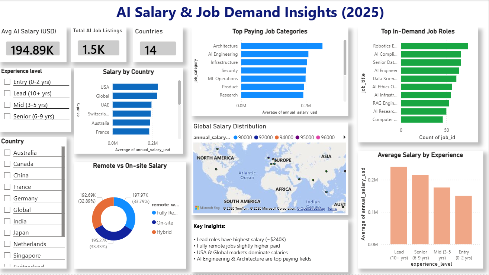

# AI Salary & Job Demand Dashboard (2025)

## 📊 Project Overview
This Power BI dashboard analyzes AI job salary trends, job demand, experience levels, and remote work patterns.

## 🔍 Key Insights
- Lead roles have highest salary (~$240K)
- Remote jobs offer slightly higher pay
- AI Engineering & Architecture are top-paying roles
- USA & Global markets dominate salaries

## 🛠 Tools Used
- Power BI
- Data Visualization

## 📸 Dashboard Preview

